<!-- markdownlint-disable MD041 -->
<p align="center">
    <picture>
        <source media="(prefers-color-scheme: dark)" srcset="https://www.yiiframework.com/image/design/logo/yii3_full_for_dark.svg">
        <source media="(prefers-color-scheme: light)" srcset="https://www.yiiframework.com/image/design/logo/yii3_full_for_light.svg">
        
    </picture>
    <h1 align="center">Debug</h1>
    <br>
</p>
<!-- markdownlint-enable MD041 -->

<p align="center">
    <a href="https://github.com/yii2-extensions/debug/actions/workflows/build.yml" target="_blank">
        
    </a>
    <a href="https://dashboard.stryker-mutator.io/reports/github.com/yii2-extensions/debug/main" target="_blank">
        
    </a>
    <a href="https://github.com/yii2-extensions/debug/actions/workflows/static.yml" target="_blank">
        
    </a>
</p>

<p align="center">
    <strong>Debugger and toolbar for Yii2 applications</strong><br>
    <em>Pico-inspired UI, scoped CSS, light/dark mode, and 14 inspection panels</em>
</p>

<picture>
    <source media="(prefers-color-scheme: dark)" srcset="docs/images/home-dark.png">
    <source media="(prefers-color-scheme: light)" srcset="docs/images/home-light.png">
    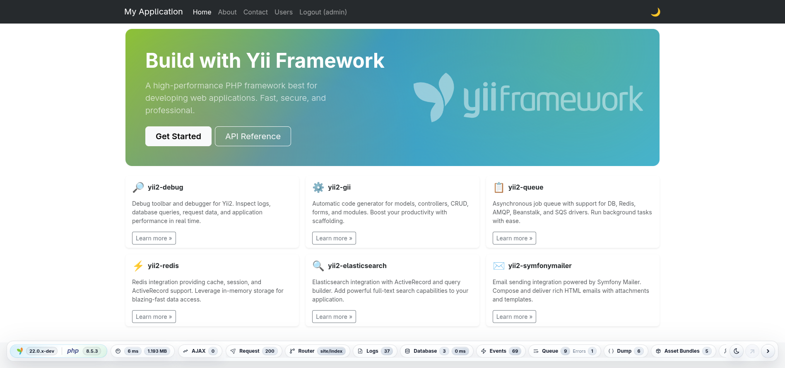
</picture>

## Features

<picture>
    <source media="(min-width: 768px)" srcset="./docs/svgs/features.svg">
    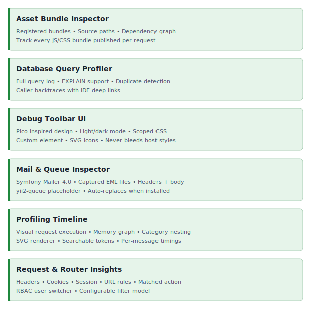
</picture>

## Quick start

### Installation

```bash
composer require yii2-extensions/debug:^0.1 --dev
```

### Basic Usage

Enable the debug module in your application configuration (`config/web.php`).

```php
if (YII_ENV_DEV) {
    $config['bootstrap'][] = 'debug';
    $config['modules']['debug'] = [
        'class' => \yii\debug\Module::class,
        'allowedIPs' => ['127.0.0.1', '::1'],
    ];
}
```

The toolbar appears at the bottom of every rendered page; click any panel chip to open the full debugger.

## Screenshots

<details>
<summary>Configuration</summary>
<picture>
    <source media="(prefers-color-scheme: dark)" srcset="docs/images/config-dark.png">
    <source media="(prefers-color-scheme: light)" srcset="docs/images/config-light.png">
    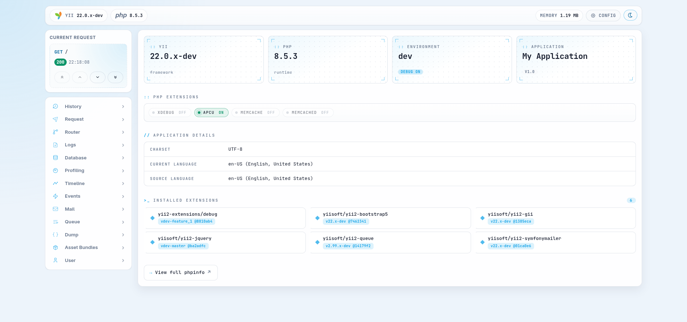
</picture>
</details>

<details>
<summary>PHP info</summary>
<picture>
    <source media="(prefers-color-scheme: dark)" srcset="docs/images/phpinfo-dark.png">
    <source media="(prefers-color-scheme: light)" srcset="docs/images/phpinfo-light.png">
    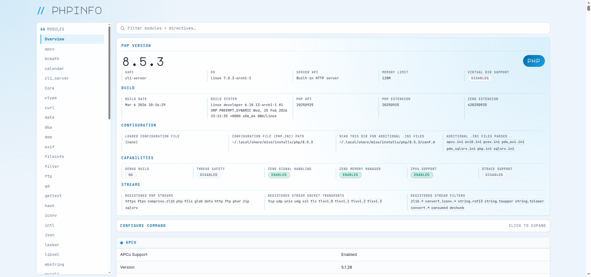
</picture>
</details>

<details>
<summary>History</summary>
<picture>
    <source media="(prefers-color-scheme: dark)" srcset="docs/images/history-dark.png">
    <source media="(prefers-color-scheme: light)" srcset="docs/images/history-light.png">
    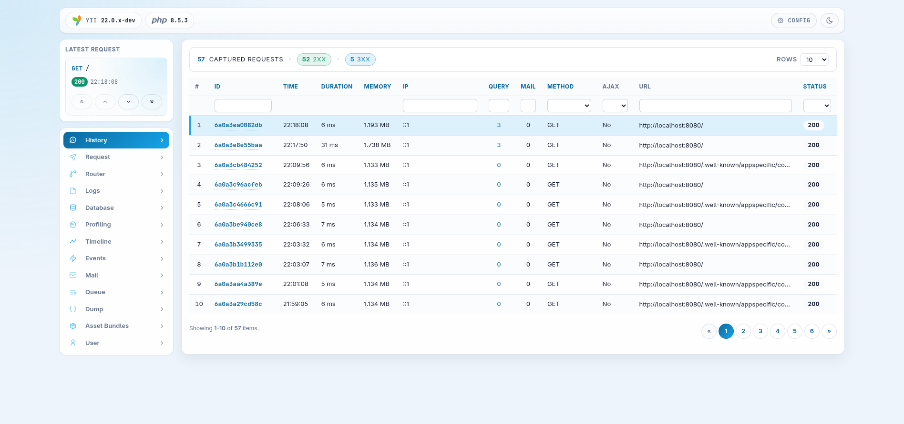
</picture>
</details>

<details>
<summary>Request</summary>
<picture>
    <source media="(prefers-color-scheme: dark)" srcset="docs/images/request-dark.png">
    <source media="(prefers-color-scheme: light)" srcset="docs/images/request-light.png">
    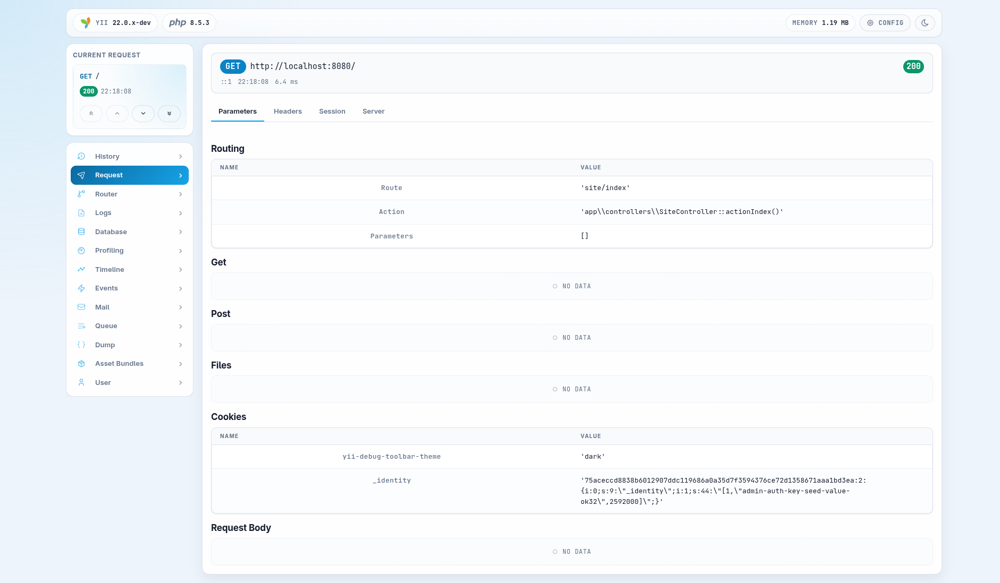
</picture>
</details>

<details>
<summary>Router</summary>
<picture>
    <source media="(prefers-color-scheme: dark)" srcset="docs/images/router-dark.png">
    <source media="(prefers-color-scheme: light)" srcset="docs/images/router-light.png">
    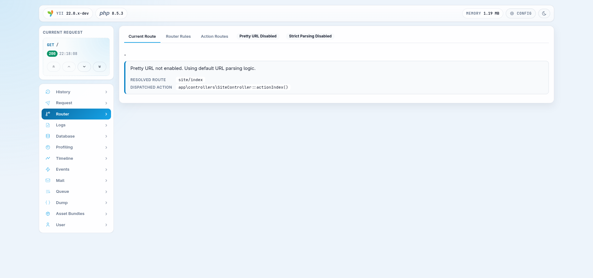
</picture>
</details>

<details>
<summary>Logs</summary>
<picture>
    <source media="(prefers-color-scheme: dark)" srcset="docs/images/log-dark.png">
    <source media="(prefers-color-scheme: light)" srcset="docs/images/log-light.png">
    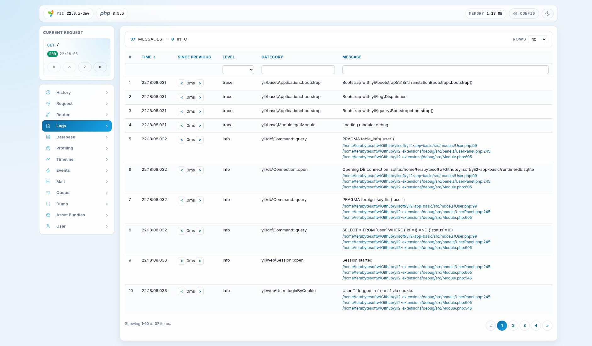
</picture>
</details>

<details>
<summary>Database</summary>
<picture>
    <source media="(prefers-color-scheme: dark)" srcset="docs/images/database-dark.png">
    <source media="(prefers-color-scheme: light)" srcset="docs/images/database-light.png">
    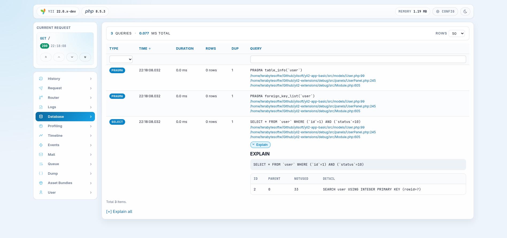
</picture>
</details>

<details>
<summary>Profiling</summary>
<picture>
    <source media="(prefers-color-scheme: dark)" srcset="docs/images/profiling-dark.png">
    <source media="(prefers-color-scheme: light)" srcset="docs/images/profiling-light.png">
    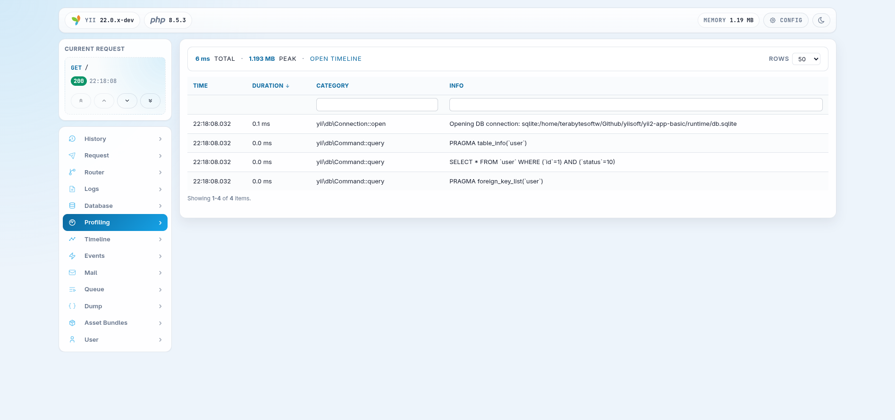
</picture>
</details>

<details>
<summary>Timeline</summary>
<picture>
    <source media="(prefers-color-scheme: dark)" srcset="docs/images/timeline-dark.png">
    <source media="(prefers-color-scheme: light)" srcset="docs/images/timeline-light.png">
    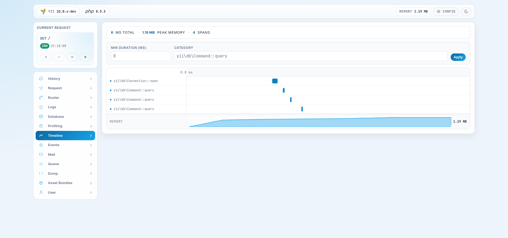
</picture>
</details>

<details>
<summary>Events</summary>
<picture>
    <source media="(prefers-color-scheme: dark)" srcset="docs/images/event-dark.png">
    <source media="(prefers-color-scheme: light)" srcset="docs/images/event-light.png">
    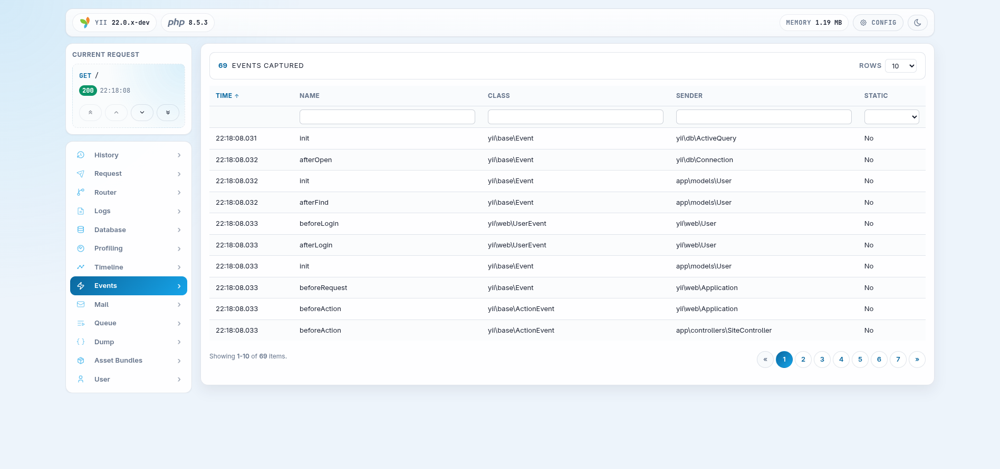
</picture>
</details>

<details>
<summary>Mail</summary>
<picture>
    <source media="(prefers-color-scheme: dark)" srcset="docs/images/mail-dark.png">
    <source media="(prefers-color-scheme: light)" srcset="docs/images/mail-light.png">
    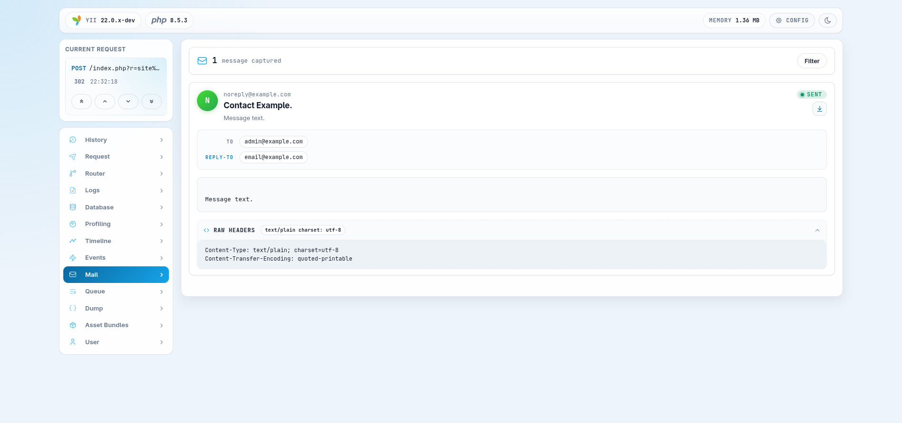
</picture>
</details>

<details>
<summary>Queue</summary>
<picture>
    <source media="(prefers-color-scheme: dark)" srcset="docs/images/queue-dark.png">
    <source media="(prefers-color-scheme: light)" srcset="docs/images/queue-light.png">
    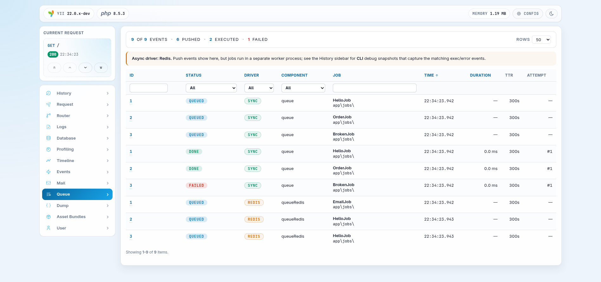
</picture>
</details>

<details>
<summary>Queue job</summary>
<picture>
    <source media="(prefers-color-scheme: dark)" srcset="docs/images/queue-job-dark.png">
    <source media="(prefers-color-scheme: light)" srcset="docs/images/queue-job-light.png">
    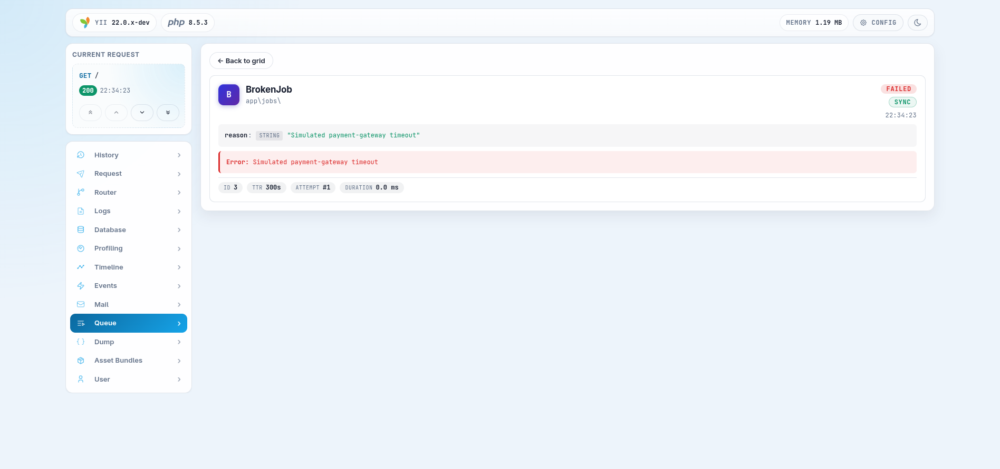
</picture>
</details>

<details>
<summary>Dump</summary>
<picture>
    <source media="(prefers-color-scheme: dark)" srcset="docs/images/dump-dark.png">
    <source media="(prefers-color-scheme: light)" srcset="docs/images/dump-light.png">
    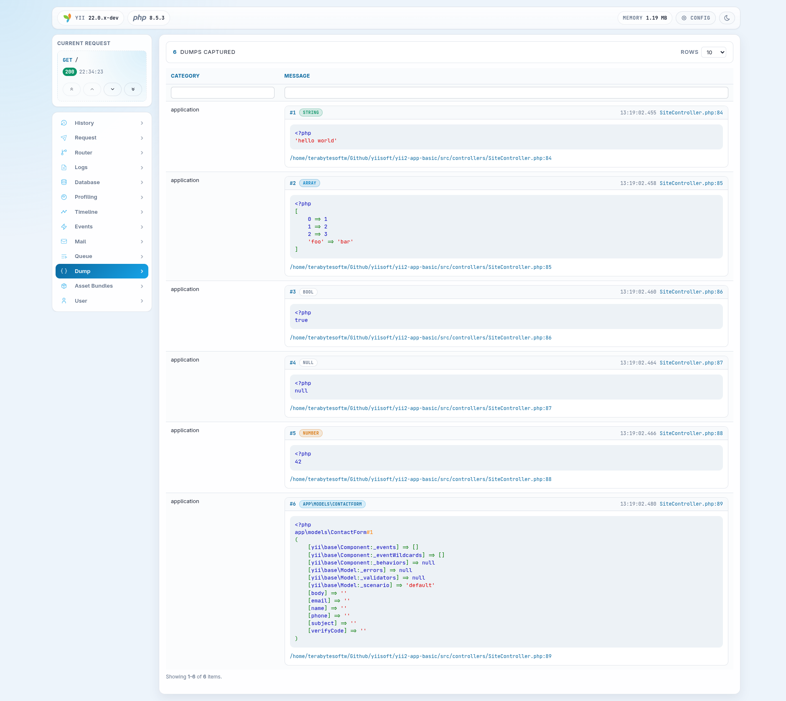
</picture>
</details>

<details>
<summary>Asset bundles</summary>
<picture>
    <source media="(prefers-color-scheme: dark)" srcset="docs/images/asset-bundles-dark.png">
    <source media="(prefers-color-scheme: light)" srcset="docs/images/asset-bundles-light.png">
    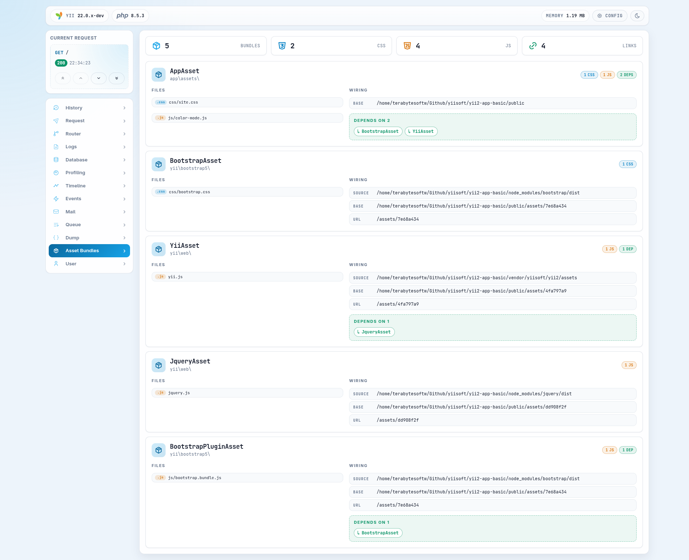
</picture>
</details>

<details>
<summary>User</summary>
<picture>
    <source media="(prefers-color-scheme: dark)" srcset="docs/images/user-dark.png">
    <source media="(prefers-color-scheme: light)" srcset="docs/images/user-light.png">
    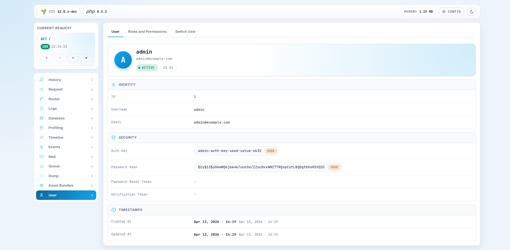
</picture>
</details>

<details>
<summary>User Roles and Permissions</summary>
<picture>
    <source media="(prefers-color-scheme: dark)" srcset="docs/images/user-roles-dark.png">
    <source media="(prefers-color-scheme: light)" srcset="docs/images/user-roles-light.png">
    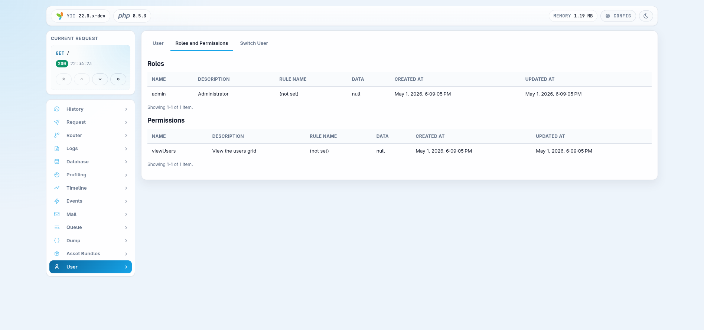
</picture>
</details>

<details>
<summary>User Switch User</summary>
<picture>
    <source media="(prefers-color-scheme: dark)" srcset="docs/images/user-switch-dark.png">
    <source media="(prefers-color-scheme: light)" srcset="docs/images/user-switch-light.png">
    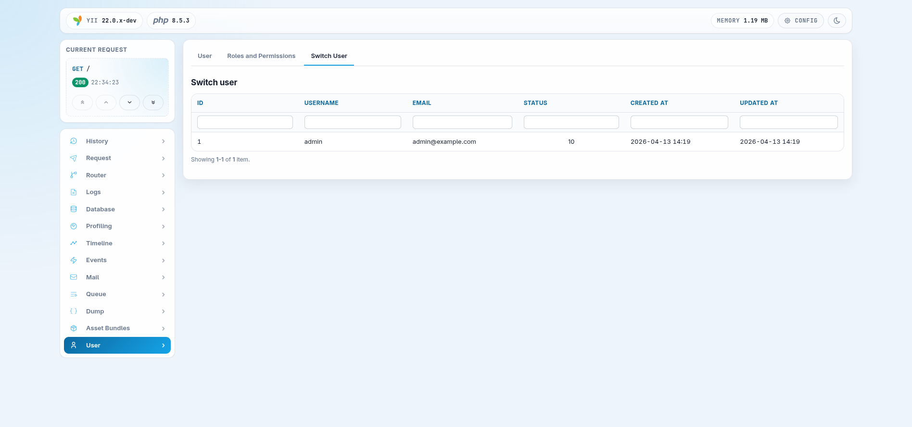
</picture>
</details>

## Documentation

For detailed configuration options and advanced usage.

- 🧪 [Testing Guide](docs/testing.md)

## Package information

[](https://www.php.net/releases/8.3/en.php)
[](https://github.com/yiisoft/yii2)
[](https://github.com/yiisoft/yii2/tree/22.0)
[](https://packagist.org/packages/yii2-extensions/debug)
[](https://packagist.org/packages/yii2-extensions/debug)

## Quality code

[](https://codecov.io/github/yii2-extensions/debug)
[](https://github.com/yii2-extensions/debug/actions/workflows/static.yml)
[](https://github.com/yii2-extensions/debug/actions/workflows/linter.yml)
[](https://github.styleci.io/repos/yii2-extensions/debug?branch=main)

## Our social networks

[](https://x.com/Terabytesoftw)

## License

[](LICENSE)
