<!-- markdownlint-disable MD041 -->
<p align="center">
    <picture>
        <source media="(prefers-color-scheme: dark)" srcset="https://www.yiiframework.com/image/design/logo/yii3_full_for_dark.svg">
        <source media="(prefers-color-scheme: light)" srcset="https://www.yiiframework.com/image/design/logo/yii3_full_for_light.svg">
        
    </picture>
    <h1 align="center">Debug</h1>
    <br>
</p>
<!-- markdownlint-enable MD041 -->

<p align="center">
    <a href="https://github.com/yii2-extensions/debug/actions/workflows/build.yml" target="_blank">
        
    </a>
    <a href="https://dashboard.stryker-mutator.io/reports/github.com/yii2-extensions/debug/main" target="_blank">
        
    </a>
    <a href="https://github.com/yii2-extensions/debug/actions/workflows/static.yml" target="_blank">
        
    </a>
    <a href="https://github.com/yii2-extensions/debug/actions/workflows/security.yml" target="_blank">
        
    </a>
</p>

<p align="center">
    <strong>Debugger and toolbar for Yii2 applications</strong><br>
    <em>Pico-inspired UI, scoped CSS, light/dark mode, and 14 inspection panels</em>
</p>

<picture>
    <source media="(prefers-color-scheme: dark)" srcset="docs/images/home-dark.png">
    <source media="(prefers-color-scheme: light)" srcset="docs/images/home-light.png">
    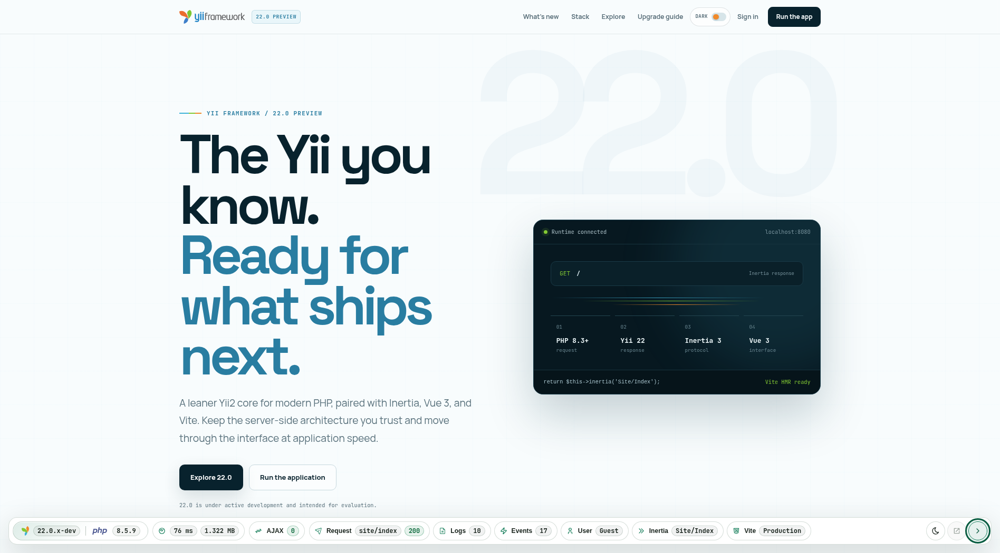
</picture>

## Features

<picture>
    <source media="(min-width: 768px)" srcset="./docs/svgs/features.svg">
    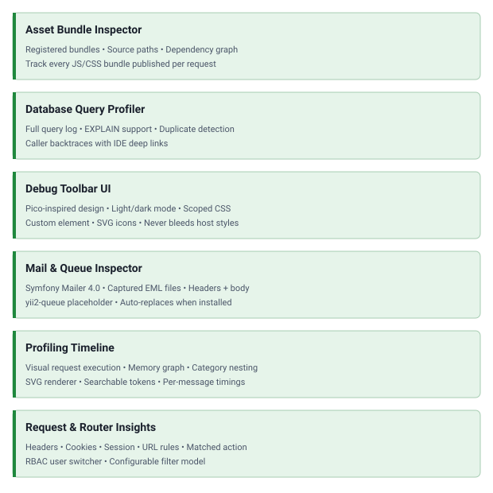
</picture>

## Quick start

### Installation

```bash
composer require yii2-extensions/debug:^0.2 --dev
```

The package installs `php-forge/debug-core` transitively. The core owns the portable snapshot and persistence model,
shared views, and frontend files; this package owns the Yii2 lifecycle, collectors, standalone actions, view rendering,
toolbar injection, and asset bundle definitions.

### Basic Usage

Enable the debug module in your application configuration (`config/web.php`).

```php
if (YII_ENV_DEV) {
    $config['bootstrap'][] = 'debug';
    $config['modules']['debug'] = [
        'class' => \yii\debug\Module::class,
        'allowedIPs' => ['127.0.0.1', '::1'],
    ];
}
```

The toolbar appears at the bottom of every rendered page; click any panel chip to open the full debugger. The complete
frontend, including the panel stylesheet, JavaScript, fonts, icons, and toolbar Web Component, is provided by
`php-forge/debug-core`. This package publishes those shared assets and supplies the Yii2-specific panels and data.
Shared PHP templates are resolved through the adapter-owned `@yiiDebugViews` alias.

Request presents the resolved route before the response status in one toolbar group. Its detail view keeps the request
identity, route, action, duration, and routing constraints visible above the canonical Input, Headers, Session, Routes,
and Server tabs. The Routes tab reads the current URL manager configuration and labels that live provenance explicitly,
because it can differ from the historical capture; the resolution trace itself remains capture-time data.

Server shows additional diagnostics without a second execution summary. Exact duplicates of the Request overview
and inbound headers move to the collapsed **Raw server variables** disclosure, which preserves every captured key
and value. Differences and unknown values remain visible; each group has an independent filter.

Input and Session sections use the shared disclosure: populated sections open by default, empty sections stay
collapsed, and each populated section has its own filter. Session data and Flashes can be searched independently.

Routes use the same expandable ledger as the Yii3 adapter, with full-width metadata details and a filter that searches
collapsed content. Rules owned by loaded debugger modules are omitted from this inventory, including renamed and
nested modules. Their trace entries are also omitted from Request; a debugger-only resolution block is hidden. The
original captured trace remains intact for the legacy Router view. Application routes are not hidden merely because
their URL contains `debug`.

The built-in Router collector and panel remain registered as Request's compatibility data source, but their duplicate
toolbar and sidebar entries are hidden. Applications that still need the legacy standalone Router screen can opt in
explicitly while migrating custom integrations:

```php
$config['modules']['debug']['panels']['router'] = \yii\debug\panels\RouterPanel::class;
```

The drawer moves focus to its close control and restores the activating chip when closed. Use `Escape` to close it,
or resize it from the keyboard with `ArrowUp`, `ArrowDown`, `Home`, and `End` on the separator.

The History page can compare any two retained captures. The comparison shows request metric deltas and per-panel
counts of added, removed, changed, and unchanged JSON paths. It never renders panel values in the overview; use the
baseline and target deep links to inspect each panel through its normal redaction and presentation rules.

### Custom collectors and panels

Register collectors explicitly through the debug module. A collector returns a typed
`PHPForge\Debug\Storage\PanelSnapshot`; a panel with the same stable ID hydrates and presents that payload. Existing
custom panels continue to capture normally when no matching collector is registered.

```php
$config['modules']['debug'] = [
    'class' => \yii\debug\Module::class,
    'collectors' => [
        \App\Debug\OrderCollector::class,
    ],
    'panels' => [
        'app.orders' => \App\Debug\OrderPanel::class,
    ],
];
```

`OrderCollector::id()` must return `app.orders`. Collector instances and Yii configuration arrays with a `class` key
are accepted as alternatives to class names. Stored collector data without a matching panel remains available through
an escaped JSON fallback.

### Capture redaction

Every persistent capture uses the shared Debug Core policy. Its defaults redact common credentials plus
environment-style keys such as `DB_PASSWORD`, `AWS_SECRET_ACCESS_KEY`, and `DATABASE_URL`, while segment-aware
matching keeps unrelated keys such as `DATABASE_HOST`, `tokenizer`, and `passwordless_mode` visible.

Configure additional rules once on the module; they apply to request bodies and superglobals, identity attributes,
queue job payloads, Inertia page props and page/location URLs, and manifest URLs:

```php
use PHPForge\Debug\Helper\SensitiveDataRedactor;

$config['modules']['debug'] = [
    'class' => \yii\debug\Module::class,
    'maxBodyBytes' => 65_536,
    'sensitiveKeys' => [
        ...SensitiveDataRedactor::DEFAULT_KEYS,
        'tenant_signing_key',
    ],
    'sensitiveKeyPrefixes' => ['internal_secret_'],
    'sensitiveKeyPatterns' => [
        '~(?:^|_)private_credential(?:$|_)~i',
    ],
];
```

`sensitiveKeys` replaces the exact-key list, so include `SensitiveDataRedactor::DEFAULT_KEYS` when extending it.
Patterns are PCRE expressions applied to the complete original key. Leave `sensitiveKeyPatterns` as `null` to use
the segment-aware defaults with the default exact-key list, or set it to `[]` to disable pattern matching explicitly.
An invalid pattern or an empty prefix rejects module initialization rather than silently weakening redaction.

Debugger endpoints emit `no-store`, `no-referrer`, `nosniff`, `noindex`, and same-origin framing policies. The adapter
preserves existing host CSP directives and replaces or adds only `frame-ancestors 'self'` on debugger responses. Keep
the module restricted to trusted development IPs or an explicit access callback; these headers are defense in depth,
not an authentication boundary.

When upgrading from 0.1, review the [0.2 upgrade guide](UPGRADE.md) before deploying the package.

### Browser support

The debugger targets evergreen browsers with ES2022, Web Components, CSS custom properties, and native module
support. Internet Explorer and other legacy browsers are not supported.

## Screenshots

<details>
<summary>Configuration</summary>
<picture>
    <source media="(prefers-color-scheme: dark)" srcset="docs/images/config-dark.png">
    <source media="(prefers-color-scheme: light)" srcset="docs/images/config-light.png">
    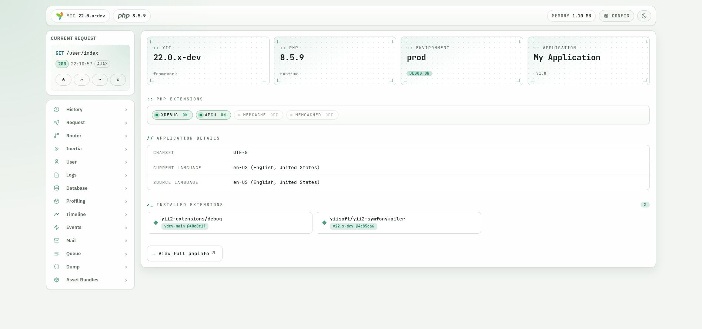
</picture>
</details>

<details>
<summary>PHP info</summary>
<picture>
    <source media="(prefers-color-scheme: dark)" srcset="docs/images/phpinfo-dark.png">
    <source media="(prefers-color-scheme: light)" srcset="docs/images/phpinfo-light.png">
    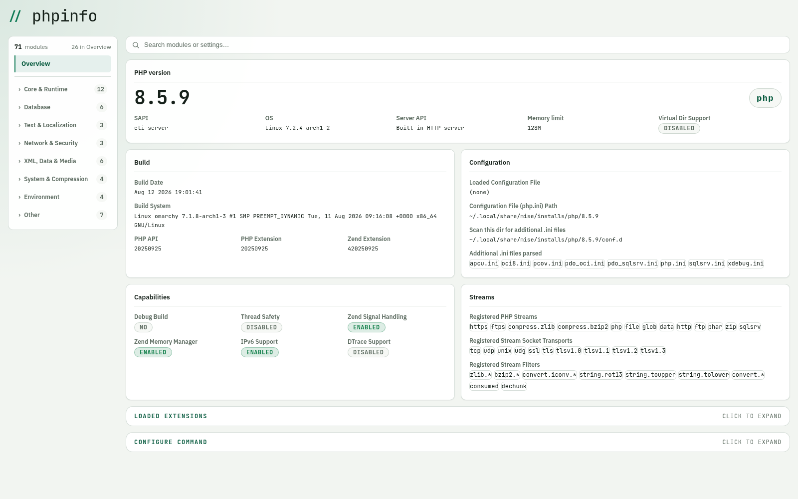
</picture>
</details>

<details>
<summary>History</summary>
<picture>
    <source media="(prefers-color-scheme: dark)" srcset="docs/images/history-dark.png">
    <source media="(prefers-color-scheme: light)" srcset="docs/images/history-light.png">
    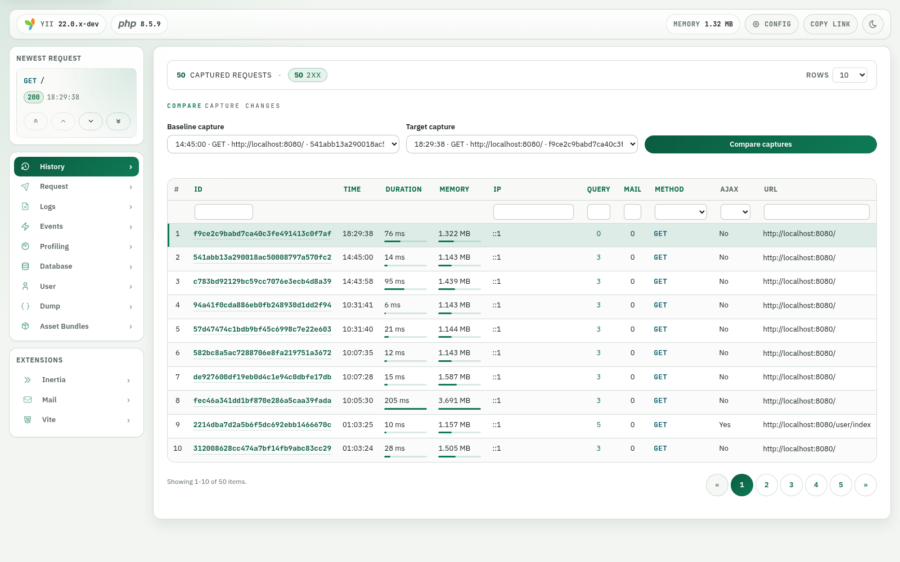
</picture>
</details>

<details>
<summary>Request</summary>
<picture>
    <source media="(prefers-color-scheme: dark)" srcset="docs/images/request-dark.png">
    <source media="(prefers-color-scheme: light)" srcset="docs/images/request-light.png">
    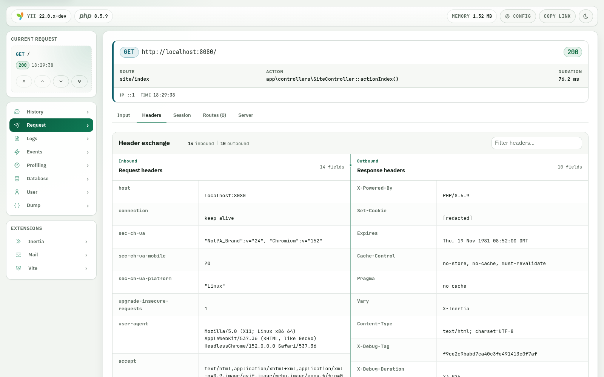
</picture>
</details>

<details>
<summary>Router (legacy standalone)</summary>
<p>The same captured routing trace is shown in Request by default. This screen remains available when Router is
configured explicitly for compatibility.</p>
<picture>
    <source media="(prefers-color-scheme: dark)" srcset="docs/images/router-dark.png">
    <source media="(prefers-color-scheme: light)" srcset="docs/images/router-light.png">
    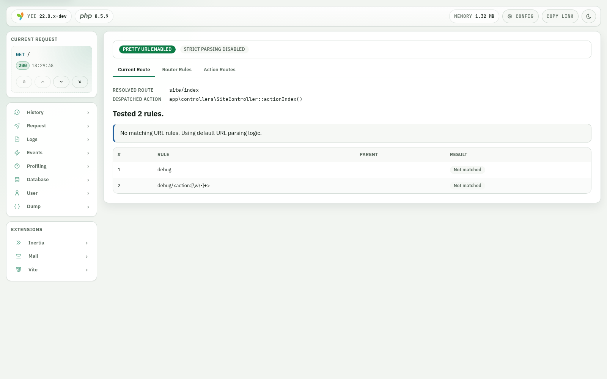
</picture>
</details>

<details>
<summary>Inertia</summary>
<picture>
    <source media="(prefers-color-scheme: dark)" srcset="docs/images/inertia-dark.png">
    <source media="(prefers-color-scheme: light)" srcset="docs/images/inertia-light.png">
    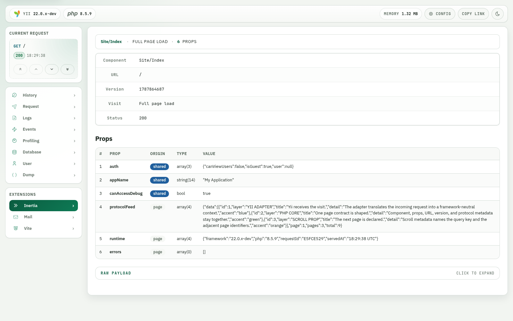
</picture>
</details>

<details>
<summary>Logs</summary>
<picture>
    <source media="(prefers-color-scheme: dark)" srcset="docs/images/log-dark.png">
    <source media="(prefers-color-scheme: light)" srcset="docs/images/log-light.png">
    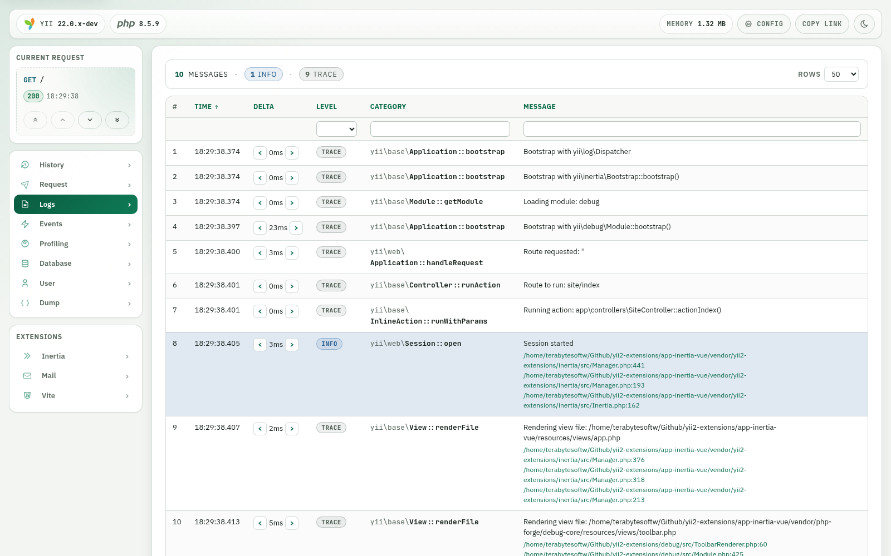
</picture>
</details>

<details>
<summary>Database</summary>
<picture>
    <source media="(prefers-color-scheme: dark)" srcset="docs/images/database-dark.png">
    <source media="(prefers-color-scheme: light)" srcset="docs/images/database-light.png">
    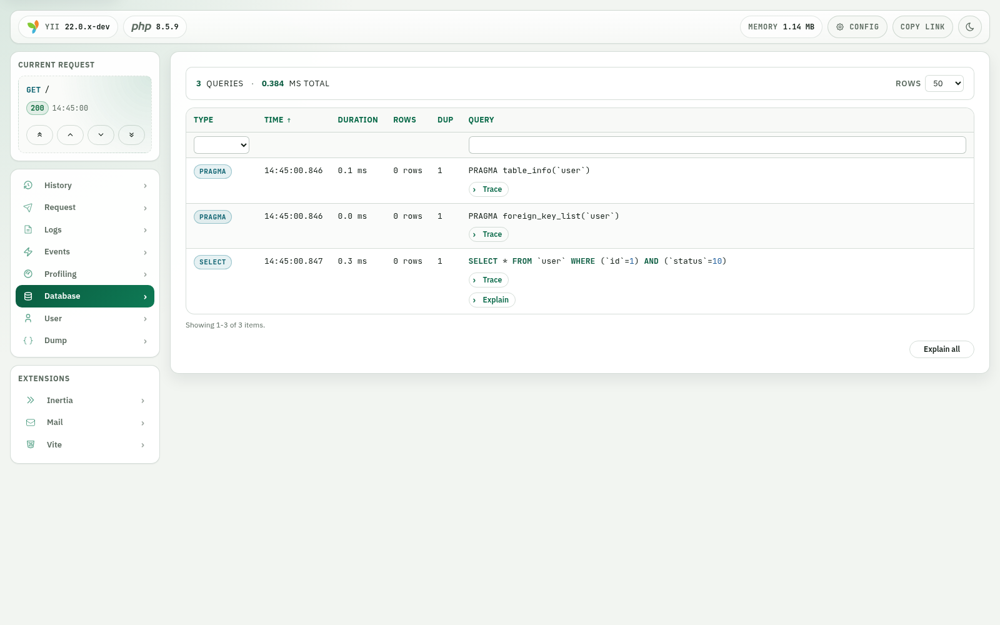
</picture>
</details>

<details>
<summary>Profiling</summary>

Profiling combines the request-relative Timeline and sortable span details under one shared set of filters.
Timeline labels show only the short class name, such as `HomeAction`; hover a label to inspect its full FQCN and
method, which also remain visible in Details.

<picture>
    <source media="(prefers-color-scheme: dark)" srcset="docs/images/profiling-dark.png">
    <source media="(prefers-color-scheme: light)" srcset="docs/images/profiling-light.png">
    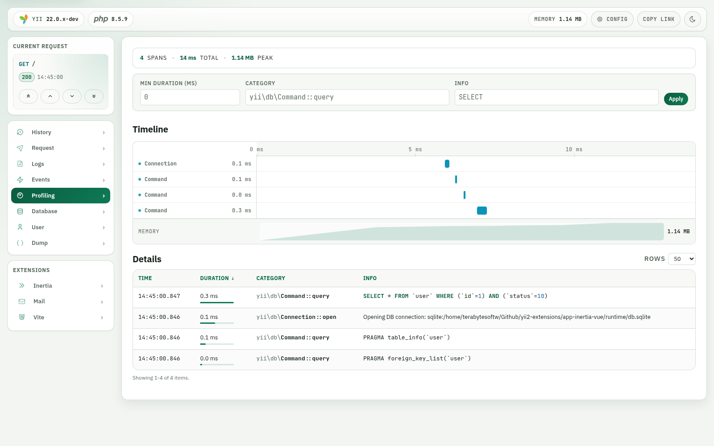
</picture>
</details>

<details>
<summary>Events</summary>
<picture>
    <source media="(prefers-color-scheme: dark)" srcset="docs/images/event-dark.png">
    <source media="(prefers-color-scheme: light)" srcset="docs/images/event-light.png">
    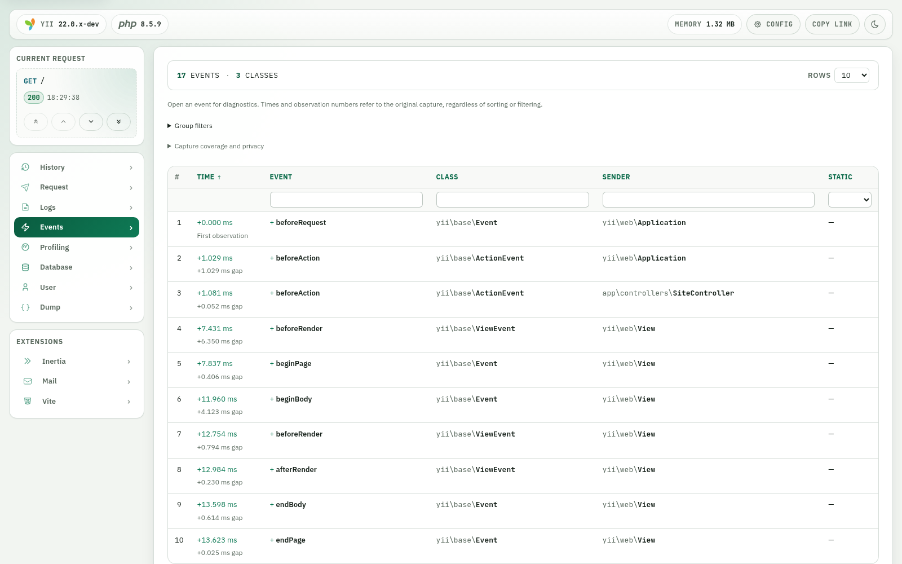
</picture>
</details>

<details>
<summary>Mail</summary>
<picture>
    <source media="(prefers-color-scheme: dark)" srcset="docs/images/mail-dark.png">
    <source media="(prefers-color-scheme: light)" srcset="docs/images/mail-light.png">
    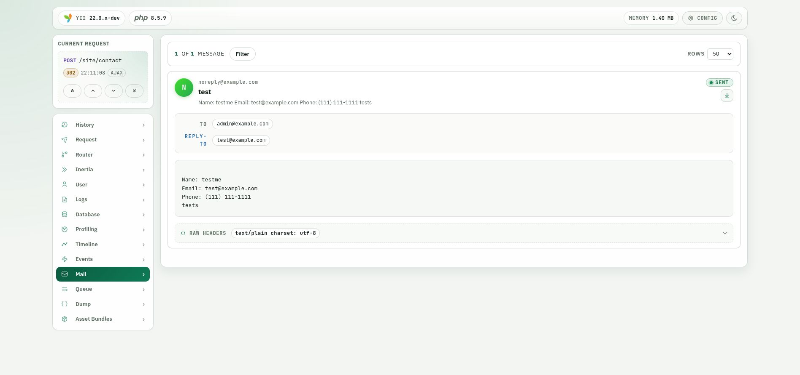
</picture>
</details>

<details>
<summary>Queue</summary>
<picture>
    <source media="(prefers-color-scheme: dark)" srcset="docs/images/queue-dark.png">
    <source media="(prefers-color-scheme: light)" srcset="docs/images/queue-light.png">
    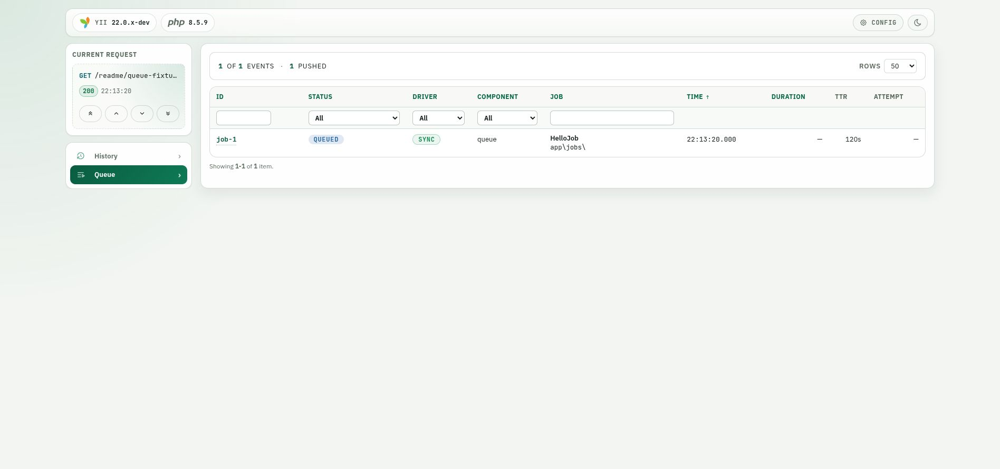
</picture>
</details>

<details>
<summary>Queue job</summary>
<picture>
    <source media="(prefers-color-scheme: dark)" srcset="docs/images/queue-job-dark.png">
    <source media="(prefers-color-scheme: light)" srcset="docs/images/queue-job-light.png">
    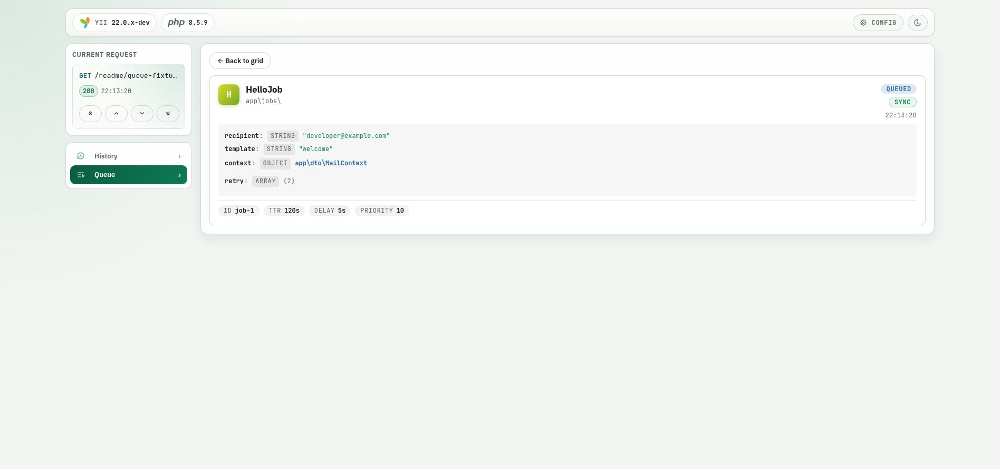
</picture>
</details>

<details>
<summary>Dump</summary>
<picture>
    <source media="(prefers-color-scheme: dark)" srcset="docs/images/dump-dark.png">
    <source media="(prefers-color-scheme: light)" srcset="docs/images/dump-light.png">
    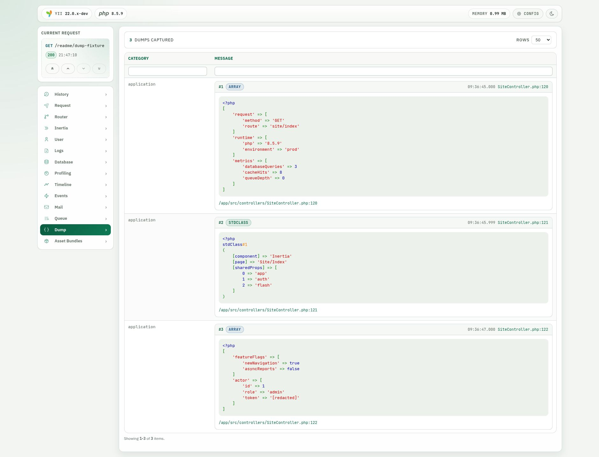
</picture>
</details>

<details>
<summary>Asset bundles</summary>
<picture>
    <source media="(prefers-color-scheme: dark)" srcset="docs/images/asset-bundles-dark.png">
    <source media="(prefers-color-scheme: light)" srcset="docs/images/asset-bundles-light.png">
    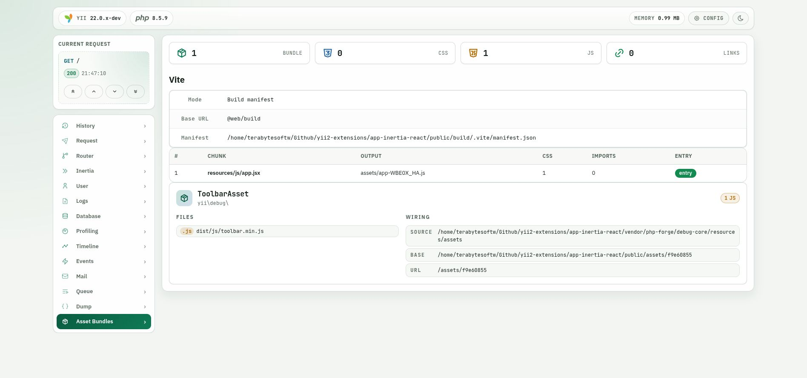
</picture>
</details>

<details>
<summary>User</summary>
<picture>
    <source media="(prefers-color-scheme: dark)" srcset="docs/images/user-dark.png">
    <source media="(prefers-color-scheme: light)" srcset="docs/images/user-light.png">
    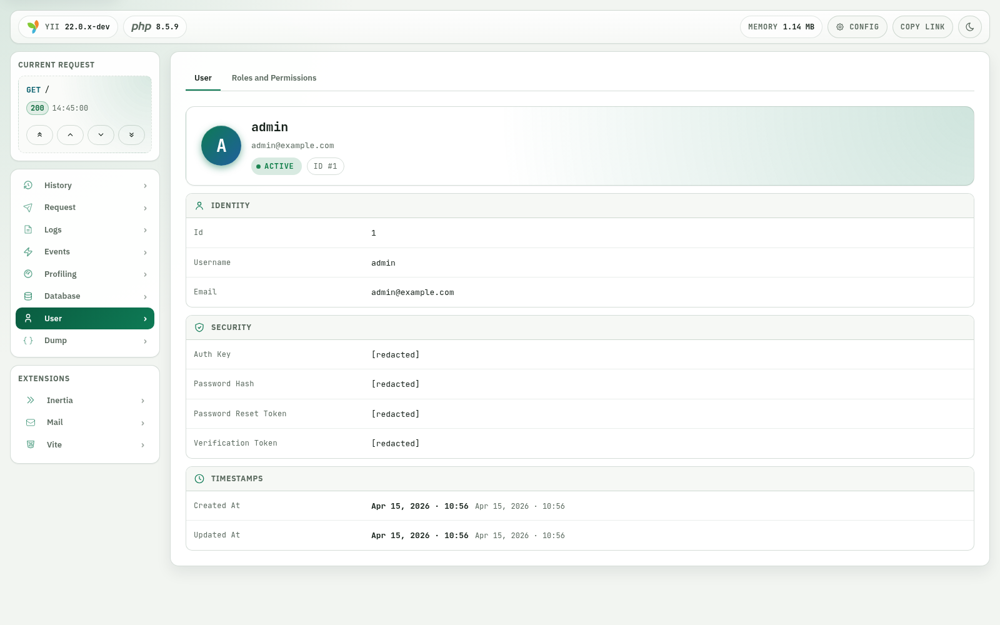
</picture>
</details>

<details>
<summary>User Roles and Permissions</summary>
<picture>
    <source media="(prefers-color-scheme: dark)" srcset="docs/images/user-roles-dark.png">
    <source media="(prefers-color-scheme: light)" srcset="docs/images/user-roles-light.png">
    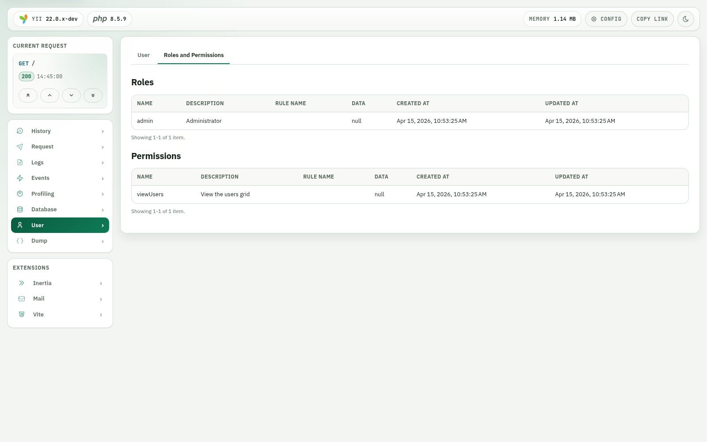
</picture>
</details>

<details>
<summary>User Switch User</summary>
<picture>
    <source media="(prefers-color-scheme: dark)" srcset="docs/images/user-switch-dark.png">
    <source media="(prefers-color-scheme: light)" srcset="docs/images/user-switch-light.png">
    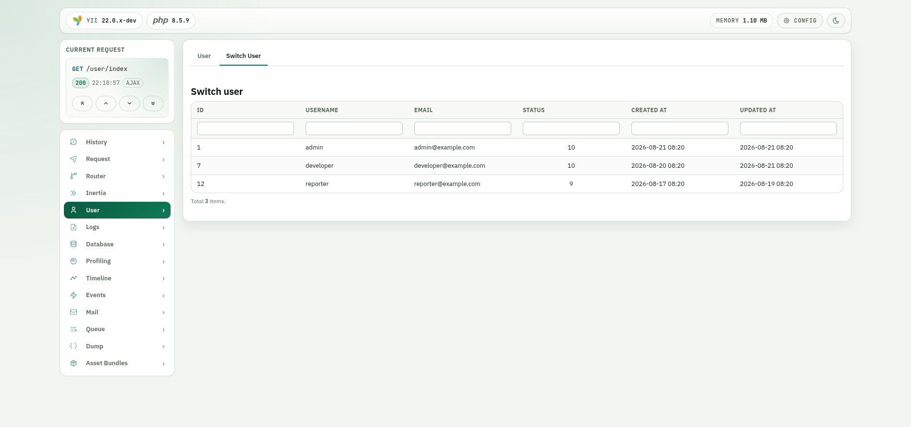
</picture>
</details>

## Documentation

For detailed configuration options and advanced usage.

- 🧪 [Testing Guide](docs/testing.md)
- [Upgrade Guide](UPGRADE.md)

## Package information

[](https://www.php.net/releases/8.3/en.php)
[](https://packagist.org/packages/yiisoft/yii2)
[](https://github.com/yiisoft/yii2/tree/22.0)
[](https://packagist.org/packages/yii2-extensions/debug)
[](https://packagist.org/packages/yii2-extensions/debug)

## Project status

[](https://codecov.io/github/yii2-extensions/debug)
[](https://github.com/yii2-extensions/debug/actions/workflows/static.yml)
[](https://github.com/yii2-extensions/debug/actions/workflows/quality.yml)
[](https://github.styleci.io/repos/699842423?branch=main)

## Our social networks

[](https://x.com/Terabytesoftw)
[](https://www.facebook.com/wilmer.arambula.9)
[](https://www.reddit.com/r/Yii2/)
[](https://t.me/yii_framework_in_english)

## License

[](LICENSE)
